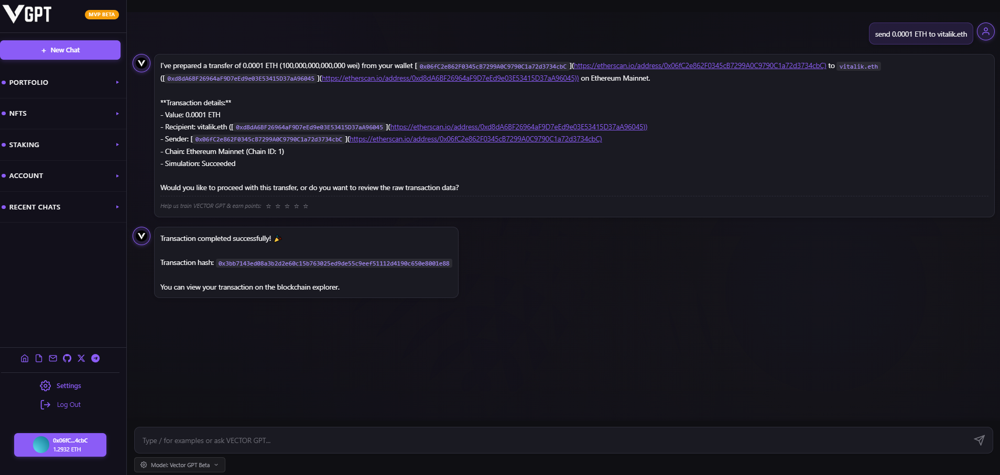
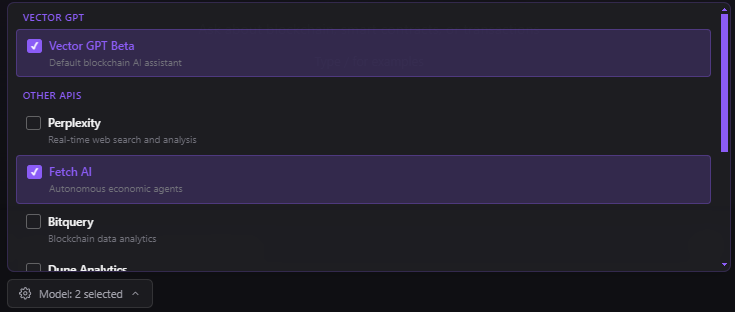

# Welcome to VECTOR AI

**Company**: VECTOR AI | **Product**: Vector GPT Chatbot | **Token**: VECTOR

VECTOR AI is a blockchain intelligence company that developed Vector GPT, an advanced AI chatbot designed for DeFi automation and blockchain analysis. Our flagship product bridges on-chain data, off-chain APIs, and GPT-powered reasoning to deliver real-time analytics and transaction capabilities.

## VECTOR Token - Now Live!

**Contract Address**: `0x569Dd3298E114Da858415ee5672C8F2AB57938Bf`\
**Network**: Ethereum Mainnet\
**Etherscan**: [View Contract](https://etherscan.io/token/0x569Dd3298E114Da858415ee5672C8F2AB57938Bf)

## **What is VECTOR AI?**

VECTOR AI is the company behind Vector GPT, a conversational AI chatbot that understands blockchain operations and can help you:

<figure><figcaption></figcaption></figure>

Vector GPT is a blockchain-connected GPT-style bot designed for advanced DeFi automation and intelligence. It bridges on-chain data, off-chain APIs, and GPT-powered reasoning to deliver real-time analytics, transaction capabilities, and automation directly through Telegram or web chat.

## Core Features:

**AI Assistant with Blockchain Connectivity**

* Whale tracking, sniper detection, contract analysis
* Telegram-based tipping, bounties, and chat summaries
* Staking and token-gated access to premium tools
* Developer-friendly API integrations for custom logic flows

**Secure & Transparent**

* 70% liquidity locked for 12+ months
* Team tokens vested with 3-month cliff + 18-month linear release
* 5% balanced buy/sell tax structure
* Multisig-controlled fund management

## How It Works

Here's the process flow:

1.  **User Input (Blockchain Execution)** - Commands via web or Telegram, Vector determines type of request (transaction or request) and process the type of request.

    <figure><figcaption></figcaption></figure>
2. **User Input (Non-Blockchain Interaction)** - Commands via web or Telegram are received. Vector identifies the request type, whether it's a transaction or information request, and processes it accordingly.

<figure><figcaption></figcaption></figure>

3. **Multiple-Source Queries** - Commands via web or Telegram are received. Vector identifies the request type, whether it's a transaction or information request, and processes it accordingly.

<figure><figcaption></figcaption></figure>

***

## Official Links

* **Website**: https://vector-ai.pro
* **Twitter/X**: https://x.com/vectorai\_x
* **Telegram**: https://t.me/vectorai\_tg
* **Email**: team@vector-ai.pro

***

## Documentation Sections

* [**Getting Started**](getting-started/overview/) - Quick start guide and platform overview
* [**Token & Economics**](broken-reference) - Complete tokenomics and allocation details
* [**Telegram Bot**](vector-bot-telegram/telegram-bot.md) - Community features and bot commands
* [**Premium APIs**](premium-apis/premium-apis.md) - Advanced features and pricing
* [**FAQ**](faq.md) - Frequently asked questions and support
