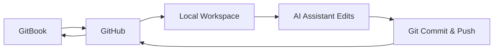

# VectorAI Docs - GitBook Workflow Setup

This repository contains tools and guides for setting up a seamless GitBook ↔ GitHub ↔ Local editing workflow.

## 🚀 Quick Start

### Option 1: If you already have a GitBook with GitHub sync

```powershell
# Clone your existing repository
.\setup_gitbook_workflow.ps1 -RepoUrl "https://github.com/yourusername/your-gitbook-repo.git" -UserName "Your Name" -UserEmail "your.email@example.com"
```

### Option 2: Starting from scratch

1. **Create a new repository on GitHub**
2. **Set up GitBook-GitHub sync** (see guide below)
3. **Clone and initialize:**

```powershell
.\setup_gitbook_workflow.ps1 -RepoUrl "https://github.com/yourusername/your-new-repo.git" -UserName "Your Name" -UserEmail "your.email@example.com"
```

## 📚 What's Included

| File | Description |
|------|-------------|
| `GitBook-GitHub-Workflow-Guide.md` | Comprehensive setup guide |
| `setup_gitbook_workflow.ps1` | Automated setup script |
| `gitbook_helpers.ps1` | Helper functions for daily operations |
| `README.md` | This file |

## 🔄 The Complete Workflow



### Step-by-Step Process:

1. **📖 Write in GitBook** → Auto-syncs to GitHub
2. **⬇️ Clone to local** → Use our setup script  
3. **🤖 Edit with AI** → Make content modifications
4. **💾 Commit & Push** → Use our helper functions
5. **🔄 Auto-sync** → Changes appear in GitBook

## 🛠️ Daily Usage

After initial setup, load the helper functions:

```powershell
# Load helper functions
. .\gitbook_helpers.ps1

# See available commands
Show-GitBookCommands
```

### Common Operations:

```powershell
# Create a new page
New-GitBookPage -Path "user-guide/new-feature.md" -Title "New Feature Guide"

# Add to navigation
Add-ToSummary -Title "New Feature Guide" -Path "user-guide/new-feature.md" -IndentLevel 1

# Check status
Get-SyncStatus

# Sync changes back to GitBook
Sync-ToGitBook -CommitMessage "Added new feature documentation"
```

## 📋 Prerequisites

- ✅ GitBook account
- ✅ GitHub account  
- ✅ Git installed on Windows
- ✅ PowerShell (built into Windows)

## 🎯 GitBook Setup Steps

1. **In GitBook:**
   - Go to your space → **Configure** → **GitHub Sync**
   - Authenticate with GitHub
   - Install GitBook app to your GitHub account
   - Select repository and branch
   - Choose sync direction (GitBook → GitHub recommended)

2. **Repository Structure:**
   ```
   your-repo/
   ├── README.md              # Main landing page
   ├── SUMMARY.md            # Navigation structure  
   ├── .gitbook.yaml         # GitBook configuration
   ├── getting-started/
   │   ├── README.md
   │   └── installation.md
   └── user-guide/
       ├── README.md
       └── advanced-features.md
   ```

## 🔍 Validation & Testing

```powershell
# Validate your GitBook structure
Test-GitBookStructure

# Check sync status
Get-SyncStatus
```

## 🌿 Branch Workflow (Recommended)

```powershell
# Create feature branch
New-GitBookBranch -BranchName "add-api-docs"

# Make changes...
# New-GitBookPage, edit files, etc.

# Sync changes
Sync-ToGitBook -CommitMessage "Added API documentation" -Branch "add-api-docs"

# Create PR on GitHub, merge to main
# GitBook will sync automatically from main branch
```

## 💡 Tips & Best Practices

### ✅ Do:
- Use descriptive commit messages
- Keep SUMMARY.md updated for navigation
- Test GitBook rendering after major changes
- Use branches for significant updates
- Follow GitBook's Markdown conventions

### ❌ Don't:
- Edit simultaneously in GitBook and locally
- Forget to sync changes
- Break SUMMARY.md structure
- Use conflicting file names

## 🎨 GitBook-Specific Markdown

GitBook supports special blocks:

```markdown

This is an info box that will render beautifully in GitBook




```javascript
console.log("Code with tabs!");
```


```python
print("Multiple language examples")
```


```

## 🚨 Troubleshooting

### Sync Issues
- Verify GitHub app permissions
- Check repository access in GitBook settings
- Ensure branch names match configuration

### Formatting Issues  
- Test complex Markdown in GitBook editor first
- Use GitBook's native blocks for best results
- Validate with `Test-GitBookStructure`

### Git Issues
- Check authentication: `git remote -v`
- Verify user config: `git config --list`
- Ensure you're in the correct directory

## 📞 Getting Help

1. **Read the full guide:** `GitBook-GitHub-Workflow-Guide.md`
2. **Check command help:** `Show-GitBookCommands`
3. **Validate setup:** `Test-GitBookStructure`
4. **Check status:** `Get-SyncStatus`

## 🎉 Success Indicators

You know everything is working when:

- ✅ Changes made locally appear in GitBook within minutes
- ✅ `Get-SyncStatus` shows all commits pushed
- ✅ `Test-GitBookStructure` passes validation
- ✅ Navigation works correctly in GitBook

---

**🤖 Ready to start editing with AI assistance!** 

Once setup is complete, you can make content modifications using this AI assistant, then sync them back to GitBook with a single command. 