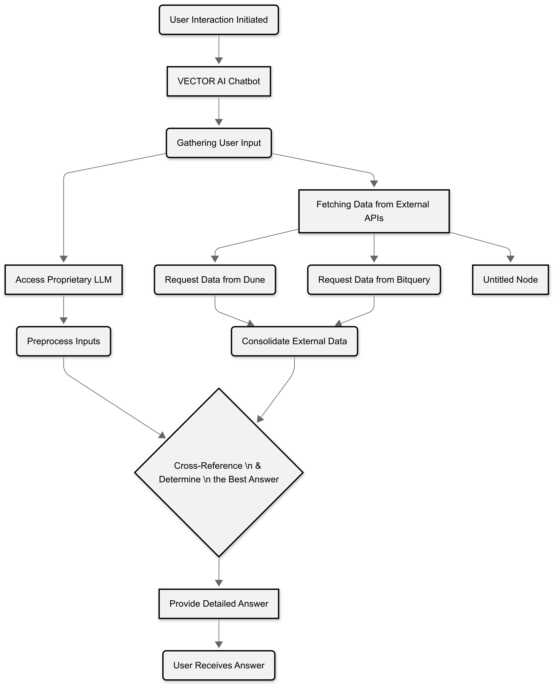

# VGPT + Custom APIs

Vector AI's system integrates multiple API endpoints to determine the most accurate source answer. The process flow involves the following steps:

1. **Input Recognition**: The system receives a query and analyzes it to identify the necessary data type and structure.
2. **API Activation**: Based on the query, the relevant API endpoints are activated to fetch data from various sources.
3. **Data Aggregation**: The data from multiple endpoints is collected and combined into a unified response.
4. **Evaluation and Selection**: The aggregated responses are evaluated using pre-set criteria to determine the most reliable answer.
5. **Response Delivery**: The best source answer is selected and delivered back to the user in a clear and concise format.

This streamlined process ensures efficient data retrieval and accurate information delivery by leveraging the strengths\
\

<figure><figcaption></figcaption></figure>
